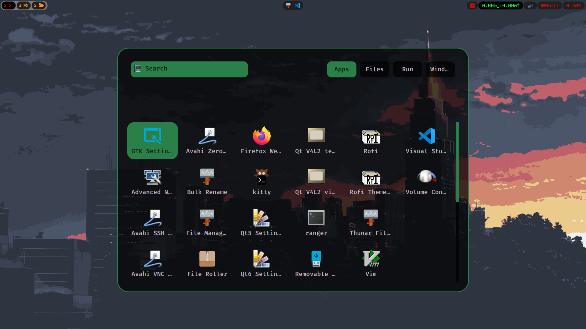
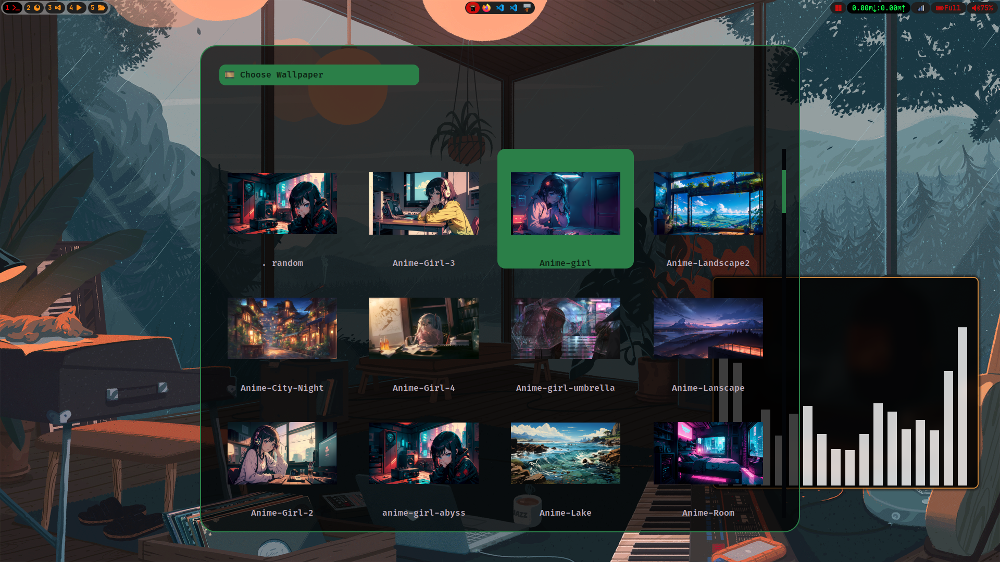

# Hypr_setup


<h2>hyprpackages</h2>
-> 28 packages

``hyprland`` :-> Hyprland packages

``hyprpaper`` :-> A tool for setting and managing wallpapers in Hyprland.

``kitty`` :-> A modern, fast, and feature-rich terminal emulator.

``curl`` :-> A command-line tool for transferring data with URLs, supporting various protocols.

``cliphist`` :-> A clipboard history manager that lets you easily access previously copied items.

``grim`` :-> A screen capture tool for Wayland compositors, used to take screenshots.

``gvfs`` :-> GNOME Virtual File System, a userspace virtual file system implementation for handling files and directories.

``gvfs-mtp`` :-> GVFS backend for accessing devices using Media Transfer Protocol (MTP).

``imagemagick`` :-> A software suite for creating, editing, and converting image files.

``network-manager-applet`` :-> A network management applet for managing network connections.

``brightnessctl`` :-> A command-line tool for adjusting screen brightness.

``pamixer`` :-> A command-line interface to adjust audio volume and manage audio devices.

``pavucontrol`` :-> A graphical interface for controlling PulseAudio sound server settings.

``polkit-gnome`` :-> Provides authentication integration for polkit with GNOME desktop environments.

``qt5ct`` :-> A Qt5 Configuration Tool for customizing the appearance and behavior of Qt5 applications.

``qt6ct`` :-> A Qt6 Configuration Tool for customizing the appearance and behavior of Qt6 applications.

``qt6-svg`` :-> A Qt6 module for handling SVG (Scalable Vector Graphics) files.

``rofi-wayland`` :-> A Wayland-compatible version of Rofi, a window switcher and application launcher.

``slurp`` :-> A Wayland utility for selecting a region of the screen (often used with grim for screenshots).

``swaync`` :-> A notification daemon for Sway and other Wayland compositors.

``swappy`` :-> A graphical tool for cropping and annotating screenshots.

``swww`` :-> A Wayland utility for setting wallpapers and managing background images.

``wofi`` :-> A Wayland-compatible menu for launching applications, similar to dmenu.

``wallust`` :-> A wallpaper manager and changer for Wayland compositors.

``waybar`` :-> A customizable status bar for Wayland compositors, providing system information and widgets.

``wget`` :-> A command-line utility for downloading files from the web.

``wl-clipboard`` :-> A Wayland clipboard manager, providing command-line tools for clipboard operations.

``wlogout`` :-> A Wayland-compatible utility for logging out, shutting down, or restarting the system.


```bash
yay -S hyprland hyprpaper kitty curl cliphist grim gvfs gvfs-mtp imagemagick network-manager-applet brightnessctl pamixer pavucontrol polkit-gnome qt5ct qt6ct qt6-svg rofi-wayland slurp swaync swappy swww wofi wallust waybar wget wl-clipboard wlogout
```

<h2>Extra packages</h2>

``visual-studio-code-bin`` :-> visual studio code editor.

``firefox`` :-> browser

``thunar`` :-> file manager

``ranger`` :-> A terminal-based file manager.

``polkit-gnome`` :-> Provides authentication integration for polkit within 
GNOME desktop environments.

``thunar-volman`` :-> A Thunar extension for managing removable media, such 
as USB drives, and automating their mounting.

``tumbler`` :-> A D-Bus service that provides thumbnailing capabilities for 
various file types, used by Thunar and other applications.

``ffmpegthumbnailer`` :-> A tool for generating video thumbnails, used by 
Thunar to create previews of video files.

``file-roller`` :-> An archive manager for GNOME that supports various 
archive formats, allowing for easy creation and extraction of compressed files.

``thunar-archive-plugin`` :-> An extension for Thunar that adds support for 
creating and extracting archives directly from the file manager.

``nwg-look`` :-> A tool for customizing the appearance of your Wayland 
desktop environment, including themes, icons, and other visual settings.

```bash
yay -S visual-studio-code-bi firefox thuna range thunar-volman tumble ffmpegthumbnaile file-roller thunar-archive-plugi nwg-loo
```

## very minimal waybar look and changed in Shortcuts..
Screenshot 1


Screenshot 2
